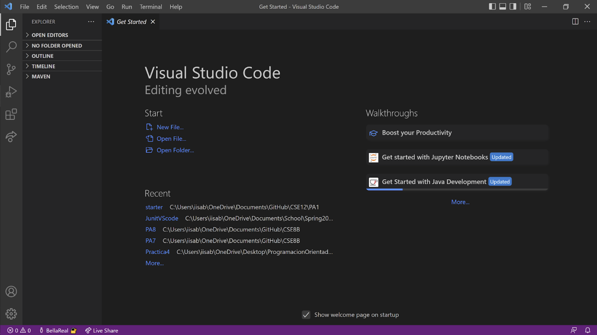
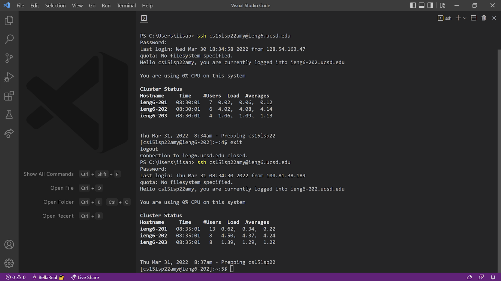
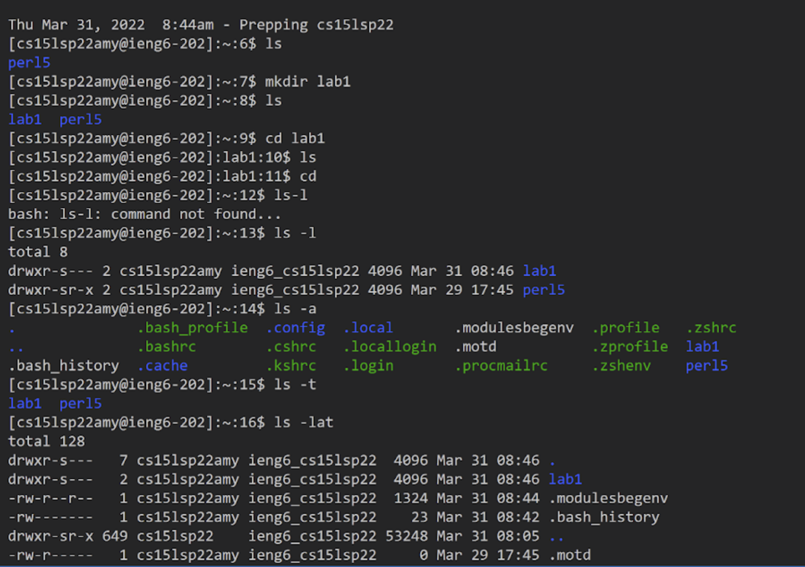
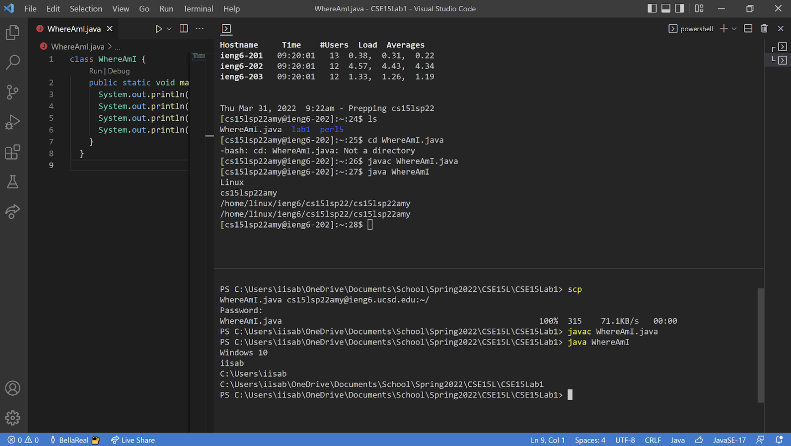
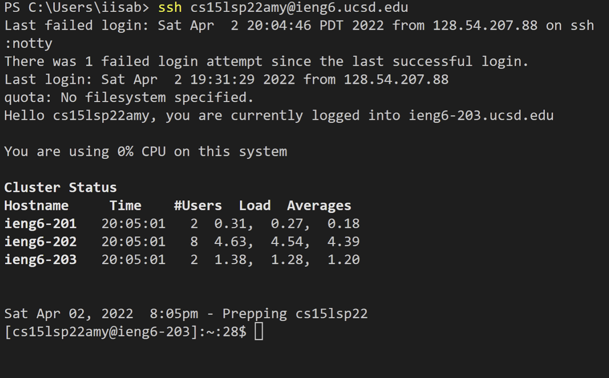
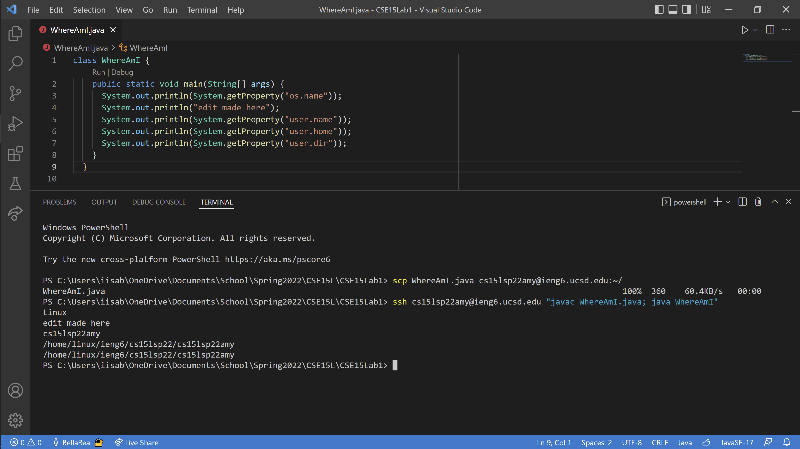

# Lab Report 1 - Remote Connecting/Running Tutorial
## By Isabella Real

Hi there and welcome to this tutorial on the steps to connecting remotely to a server. I will walk you through 6 simple steps to get you started with some of the cool things that you can do with remote access.


### Installing VSCode

Begin by installing VSCode on your computer.  This IDE is extremely useful when it comes to testing and writing code.  Once it is installed, open it up and your screen should look something like the image above.


### Remotely Connecting

Now, to remotely connect open up a terminal which can be done by clicking the button at the top of the screen that says *Terminal* and then clicking on *New Terminal*.  Next, what you want to do is type in the ssh command followed by the account on the server you want to connect to.  It should look something like this: 

 ```       
ssh cs15lsp22@ieng6.ucsd.edu
```

You will be asked to enter your password and while you're typing, it won't look like anything is happenning but this is normal. Just enter your password as usual and you should be able to get into the server like this.


### Trying Some Commands

Below is a list of some UNIX commands and what their purpose is:
- `ls` (lists all names of files in the current directory)
- `mkdir` (makes new directory)
- `cd`, `cd~` (changes directory)
- `ls -l`, `ls -a`, `ls -lat` (long listing lists files with more information than just their name, listing all files including hidden ones, listing all of that information together)
- `cat` (displays contents of a file)
- `rm` (deletes file)
- `mv` (changes name of file)
- `pwd` (prints working directory)


### Moving Files with scp

If you want to copy a file from your computer to a remote one, just follow these simple steps!

1. In the terminal on your computer, use the scp command along with the file you want to copy and the location of where you want to copy it to like this: 

```
scp name-of-file-here cs15lsp22@ieng6.ucsd.edu:~/
```

2. Then, you will be prompted to enter your password for that account on the server you are sending it to. After entering your password you should see the name of the file and some information about it.

3. Then, using the ssh command, you can log into your account remotely, enter your password, and view the file you copied over using the ls command.


### Setting an SSH Key

Setting up an ssh key can save you a lot of time! This makes it so that you don't have to type in a password every time you try to connect remotely.  As you can see in the image above, the user wasn't asked to input a password when they attempted to log in.  In order to do this, type `ssh -keygen` into the terminal on *your* computer.  You will be prompted to enter a passphrase, and when this happens, just click enter. If you're on windows, there are a few extra steps to take in order to complete the process so follow the steps [here](https://docs.microsoft.com/en-us/windows-server/administration/openssh/openssh_keymanagement#user-key-generation). Lastly, make a new directory on the server computer and copy the public key into. Use `mkdir .ssh` to make the directory and then on your own computers terminal, use `scp /Users/<user-name>/.ssh/id_rsa.pub cs15lsp22@ieng6.ucsd.edu:~/.ssh/authorized_keys` with the proper directory and username and all that. After completing all that, you can ssh and scp from your computer to the server without entering your password saving loads of time!

### Optimizing Remote Running

Now that you've made an ssh key, you are able to run things very easily remotely.  The best process I came up with is this:
1. In *your* computer's terminal in the directory with the file you want to copy over and run remotely, copy the file over like normal using `scp`
2. To run it, all you have to do is run the following code:
```
ssh cs15lsp22@ieng6.ucsd.edu "javac FileToRun.java; java FileToRun"
```
