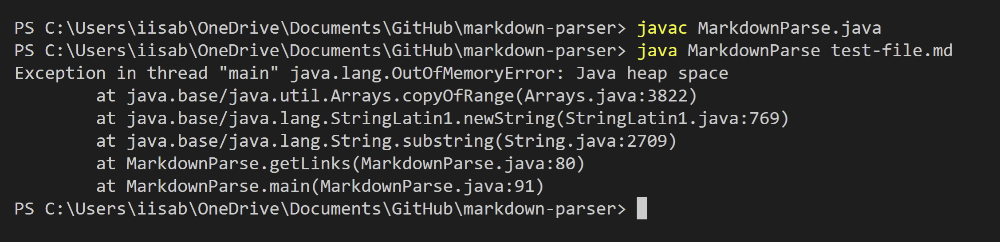
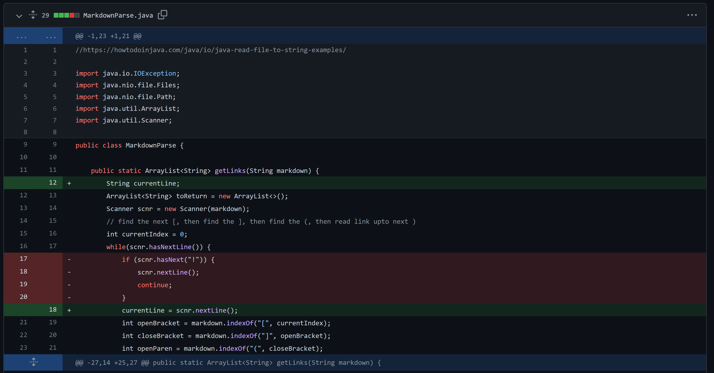
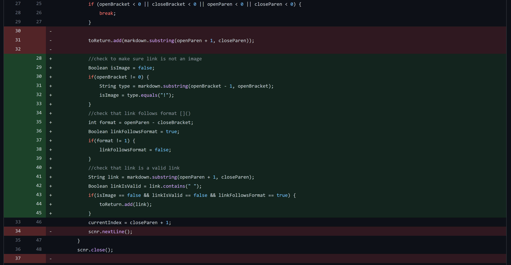
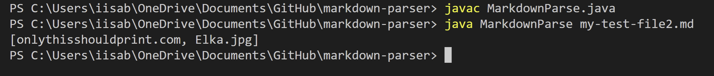
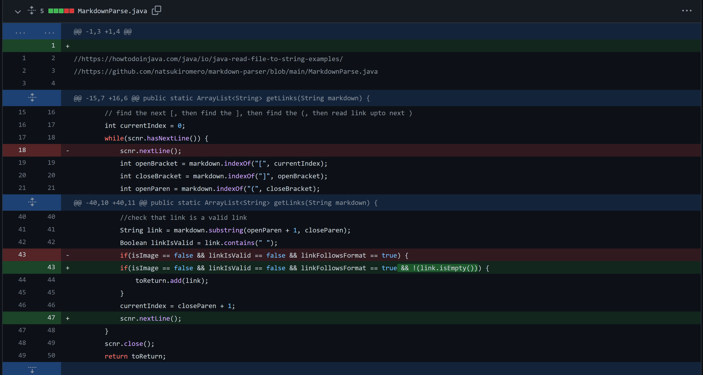
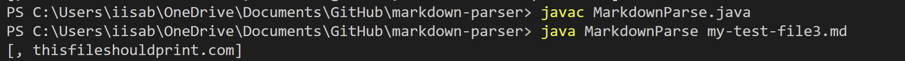

# Lab Report 2 - Incremental Development/Bugs
## By Isabella Real

In this lab report, I will outline 3 different bugs found when trying to search 
for and print out the links to sites in a .md file.

---

### Bug 1: empty lines at end of code -> infinite loop

**Here are the changes made in the code to fix the bug:**

**Link to the test file that caused the bug:**
[https://github.com/BellaReal/markdown-parser/blob/main/my-test-file1.md](https://github.com/BellaReal/markdown-parser/blob/main/my-test-file1.md)

**Here is a symptom of the bug:**

**Explaination of bug/symptom/failure-inducing input:**

This bug was caused in part by the loop boundaries that originally didn't stop 
until at the end of a file. The symptom was an infinite loop whenever a file had
 empty lines at the end of it.  Any files with empty lines would be considered 
 failure-inducing inputs in this case.

---

### Bug 2: images in code -> images printed in output

**Here are the changes made in the code to fix the bug:**

**Link to the test file that caused the bug:**
[https://github.com/BellaReal/markdown-parser/blob/main/my-test-file2.md](https://github.com/BellaReal/markdown-parser/blob/main/my-test-file2.md)

**Here is a symptom of the bug:**

**Explaination of bug/symptom/failure-inducing input:**

This bug is from us not distinguishing between images and links since the format
 is almost the same for images as it is for links.  The symptom of the bug is 
 that the image file name is being printed as a link, when we are only looking 
 for links.  The failure-inducing input is any file with an image.

---

### Bug 3: empty proper formatting -> incorrect output

**Here are the changes made in the code to fix the bug:**

**Link to the test file that caused the bug:**
[https://github.com/BellaReal/markdown-parser/blob/main/my-test-file3.md](https://github.com/BellaReal/markdown-parser/blob/main/my-test-file3.md)

**Here is a symptom of the bug:**

**Explaination of bug/symptom/failure-inducing input:**

This bug is a result of our code not handling cases where links are formatted 
incorrectly.  The symptom of this bug is that the program is outputting more 
than it should.  The failure-inducing input is a pair of brackets and a pair of 
parenthesis in the correct order to signify a link, with nothing inside them.

