# Lab Report 3 - More Cool Things with ssh and Remote Connecting
## By Isabella Real

This week's lab report helps us make connecting and running things remotely
even more pleasant and streamlined.

### Streamlining ssh configuration

- **Here is the updated config file containing the information for the ieng6 server and my account information**
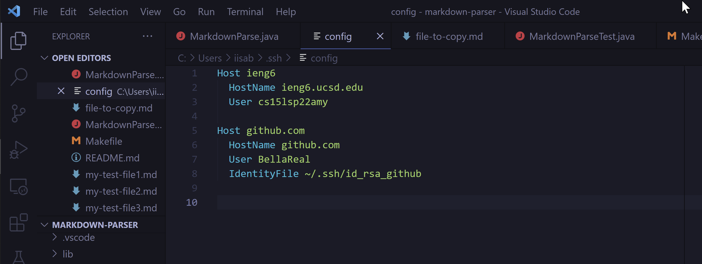
This allows us to just use the command `ssh ieng6` rather than the much longer original command `ssh cs15lsp22amy@ieng6.ucsd.edu` to log onto the ieng6 server.

- **Here is the ssh command in action with the updated config file**
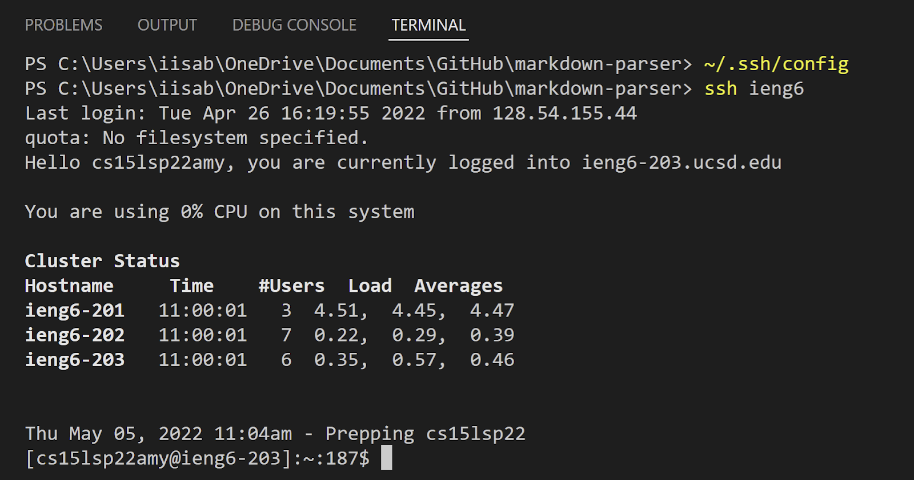
From the above image, you can see that all that was needed to log into the server was the short command `ssh ieng6`

- **Here I am copying a file over to the server using scp and the shortened server information**
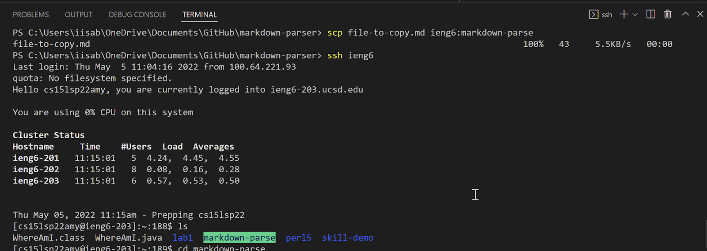
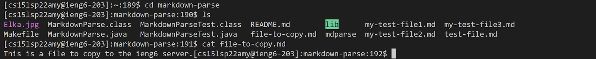
From the above images, it is clear that not only does the key work for logging into the server, but any location that you would use `cs15lsp22amy@ieng6.ucsd.edu` in the past, you can now instead use ieng6.

### Setup Github Access from ieng6

- **This is where the public key I made is stored on Github and in my user account.**
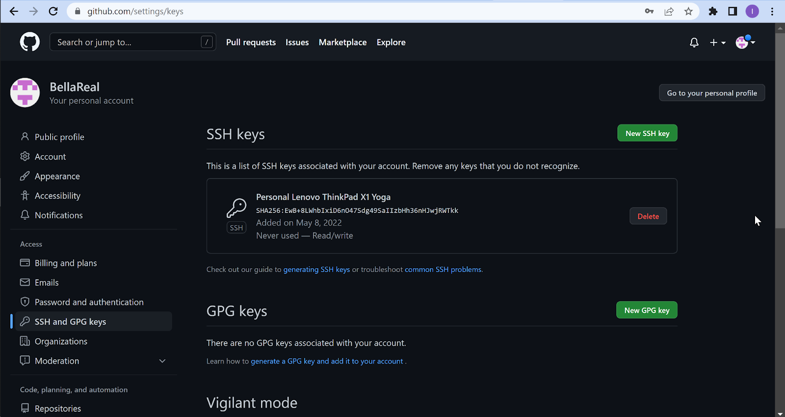
Above is where my public key can be found on my Github account in settings.
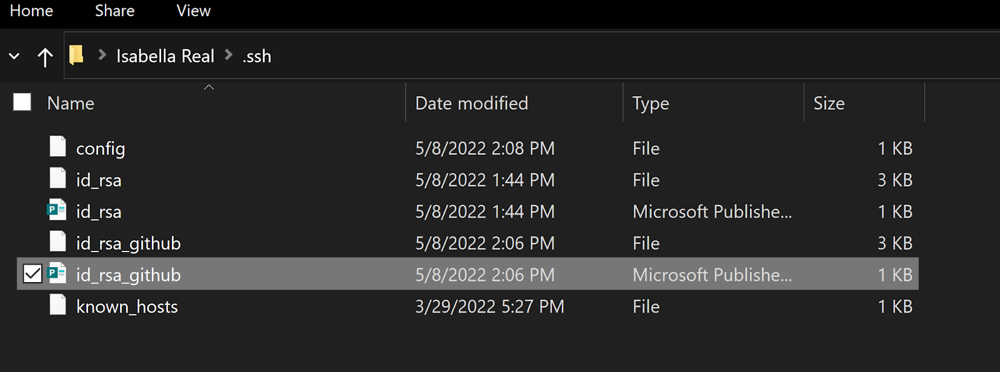
Here is where the same public key is stored on my laptop in file explorer.

- **Here is where the private key I made is stored on my user account**
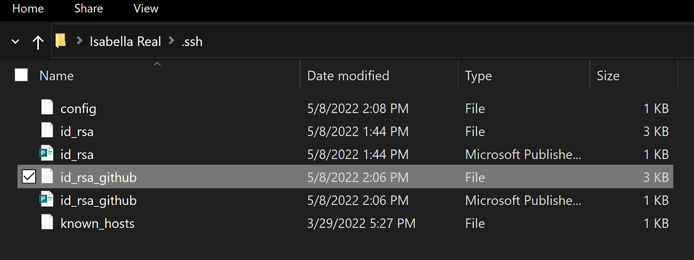

- **Here I am running git commands to commit and push a change to Github while logged into my ieng6 account**
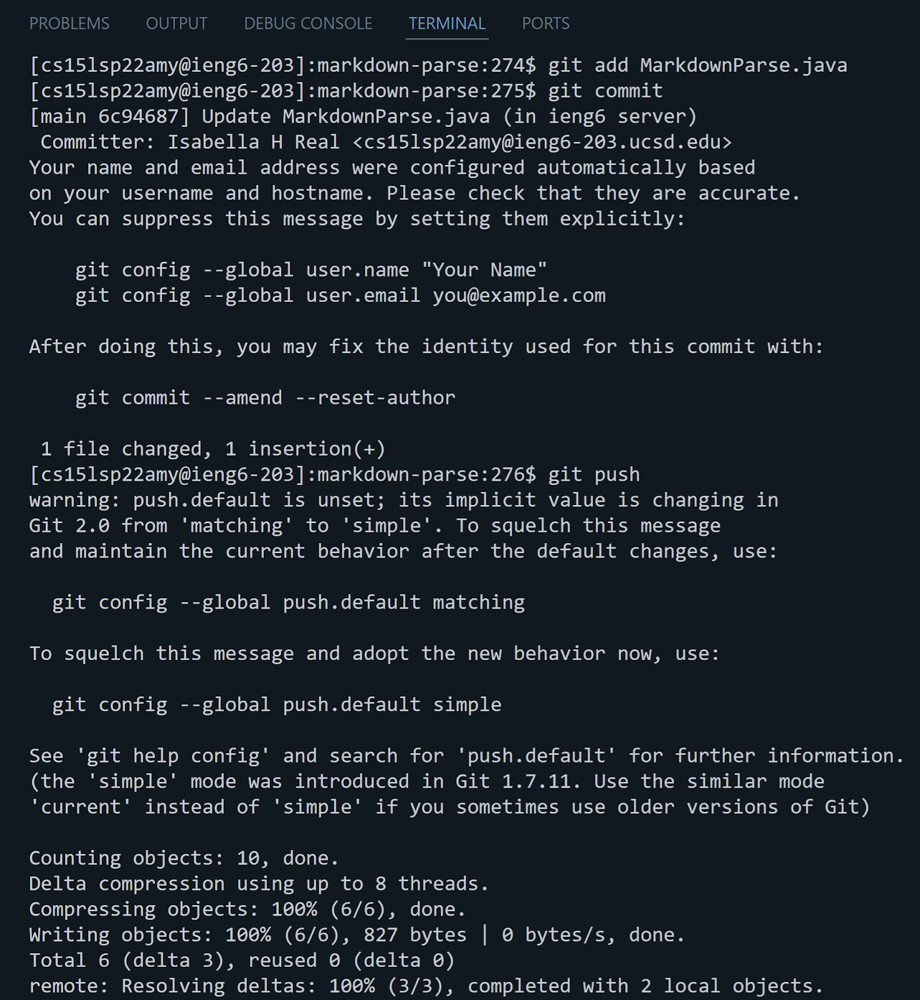
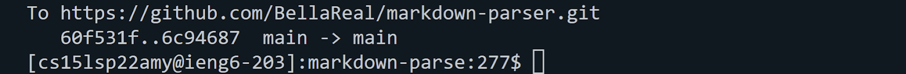
Above are the unix commands I used in order to properly commit and push a change from the ieng6 server, to github.  First, I made an edit in the server. Then, also in the server, I typed:
```
git add MarkdownParse.java
git commit
git push
```
which allowed me to stage the edited file, commit the changes, and push them to the origin.

- **Here is a link for the resulting commit**
[https://github.com/BellaReal/markdown-parser/commit/6c94687af7a356ad7141acadea8027ea1013f0e4](https://github.com/BellaReal/markdown-parser/commit/6c94687af7a356ad7141acadea8027ea1013f0e4)
At the above link, you can see that the commit and push in the server, worked.

### Copy Whole Directories with scp -r

- **Here I copied my whole markdown-parse directory to your ieng6 account**
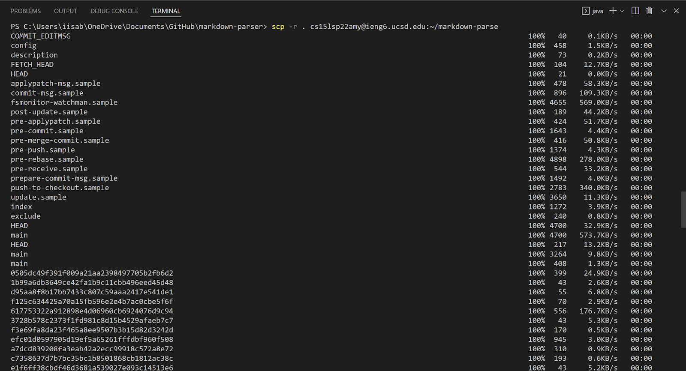
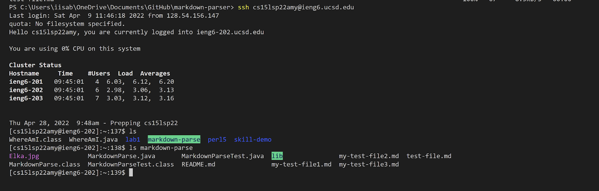
By using the command `scp -r . ieng6:~/markdown-parse` in the markdown-parse directory on my pc, I copied the contents of the entire current directory into the server into a directory called markdown-parse. 

- **Here while in my ieng6 account, I compiled and ran the tests for my repository**
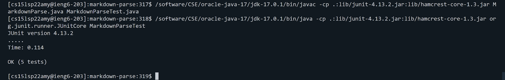
In order to compile and run tests on my ieng6 account, I needed to change a couple things about the way I typed the commands.  Rather than using `javac` and `java` when creating class files and running the junit tests, I needed to replace each of them with `/software/CSE/oracle-java-17/jdk-17.0.1/bin/javac` and `/software/CSE/oracle-java-17/jdk-17.0.1/bin/java` respectively.  Something else I did was make sure the server didn't have any .class files in the markdown-parse directory to start out with.


- **Here I combine scp, ;, and ssh to copy the whole directory and run the tests in one line**
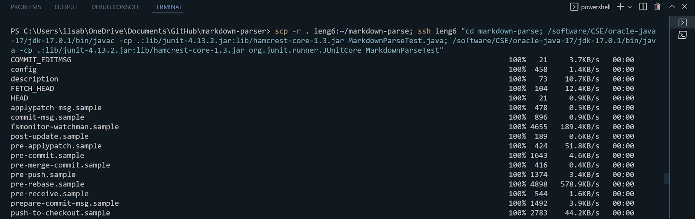
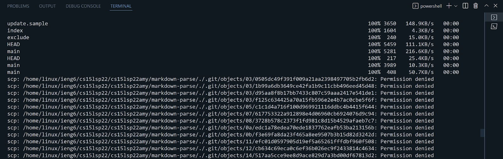
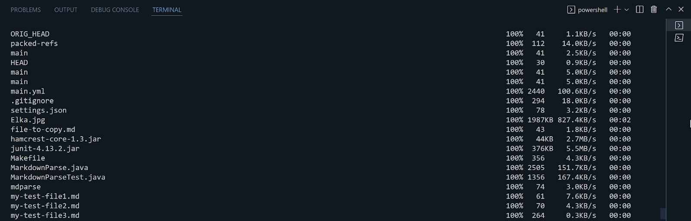
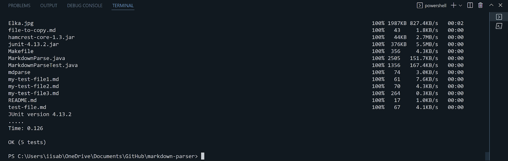

These images show me utilizing `scp` to copy the directory over, `ssh` to compile and run tests in the server, and `;` to run these multiple commands in one line.  Like the previous example, for compiling and running I also needed to replace `javac` and `java` with the same commands as before.
