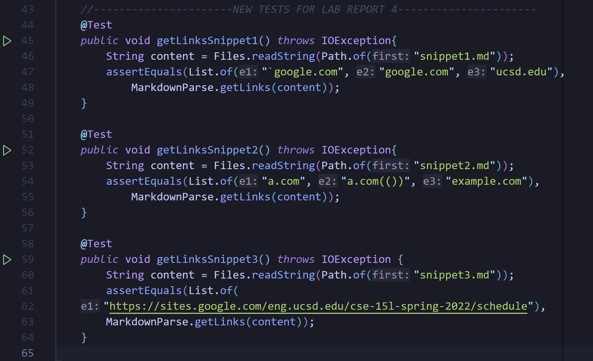
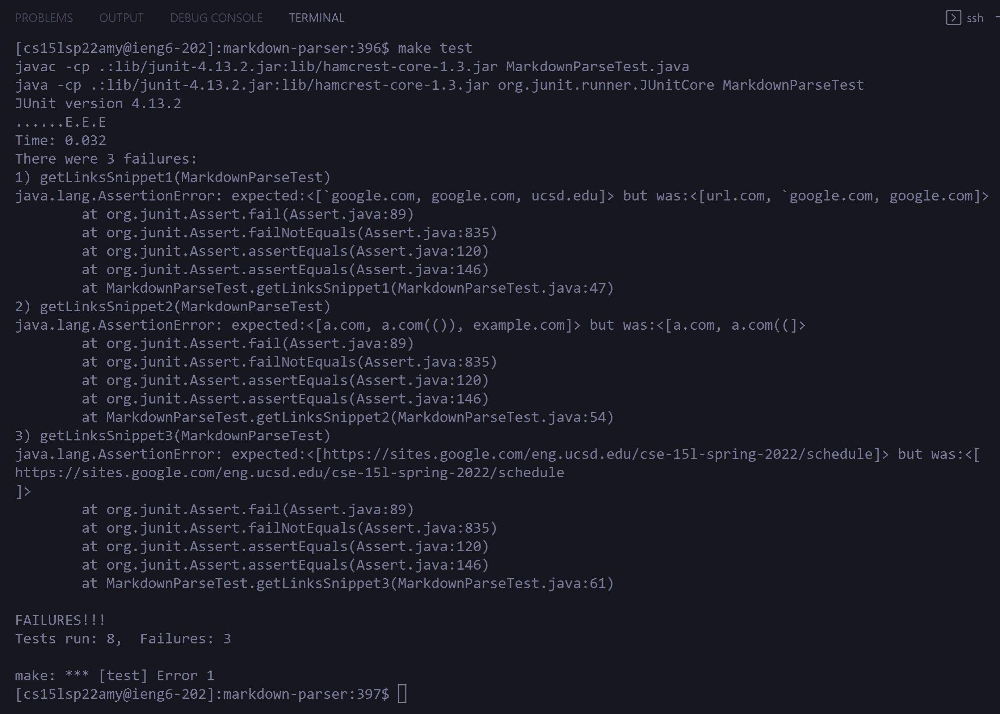
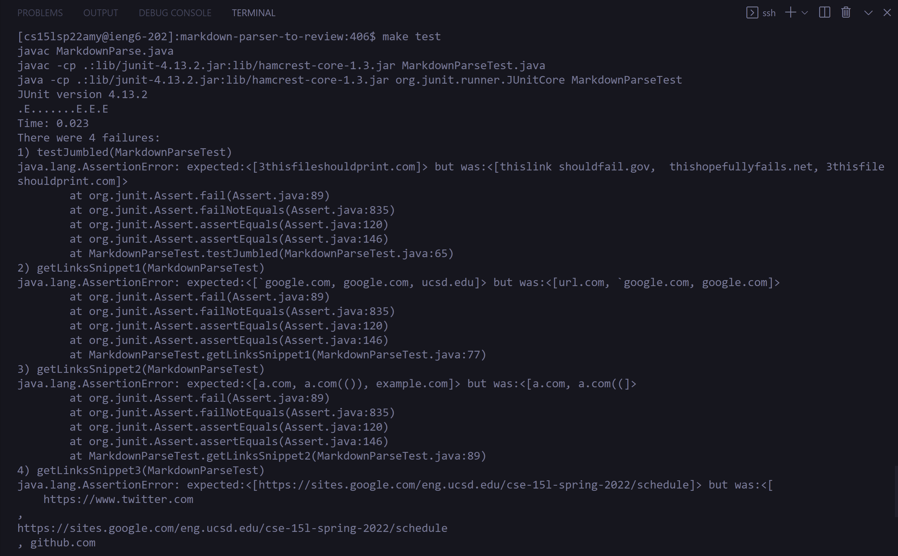
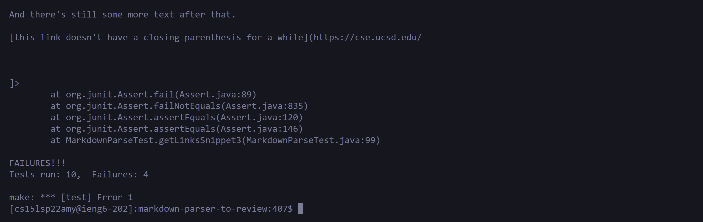

# Lab Report 4
## By Isabella Real

**Below are links to two different markdown-parser repositories**
- The repo my group has been working on:
[My Lab Group's Repository](https://github.com/BellaReal/markdown-parser)
- The repo my group reviewed in Lab 7:
[Reviewed Repository](https://github.com/tcarman/markdown-parser)

### Here are the new tests that I added in both my repository as well as the repo we reviewed.

---

### Here is my repo's output for the newly added tests that didn't pass:

### Could the code in *my repo* be fixed in less than 10 lines for each of the tests?
- Test 1: This first case will probably need more than 10 lines of code to fix.  The problem seems to have to do with where the backtics are placed relative to the brackets, so I would write a method to determine if something is considered an inline code snippet or not.  Then, I would include that into one of the checked conditions of if something is a proper link or not.
- Test 2: No, this case will most likely need more than 10 lines of code to fix it.  The original formatting guidlines used to determine if a link is valid or not would need to be revised so this fix will be a bit more extensive.  It needs work on the formatting for the brackets in addition to the formatting for the parenthesis.
- Test 3: This case could be fixed more easily, probably in under 10 lines of code.  All that would be needed to fix this case would be to get rid of the empty space and new lines inside the parenthesis for the resulting link.

---

### Here is the reviewed repo's output for the newly added tests that didn't pass:

### Could the code in the *reviewed repo* be fixed in less than 10 lines for each of the tests?
- Test 1: This case will probably need more than 10 lines of code to fix since similar to the fix for my repo, there would have to be some accounting for backtics and whether something is an inline code snippet or not.  This could be a little tricky since some of the links would still be valid even though there are backtics so the implementation would need to make sure that depending on where the back tics are, determines whether or not the link is valid or not.
- Test 2: No, this case is probably going to require more than 10 lines of code to fix it.  MarkdownParse.java does not have a good handling on additional brackets and/or parenthesis that are scattered throughout.  There would need to be some sort of fix that involves finding the outer parenthesis and brackets and working with what is inside those.
- Test 3: This case would most likely need more than 10 lines of code for a fix.  The result just printed almost everything in the file, which is pretty far off from what our desired result should look like.  To fix this issue, we would need to work on how new lines are read in MarkdownParse.java.  I would recommend implementing a scanner to help you determine when you've reached a new line in the code: `\n` but even with the scanner, some work would need to be done on the parsing of the output into a proper link which would be some work.
