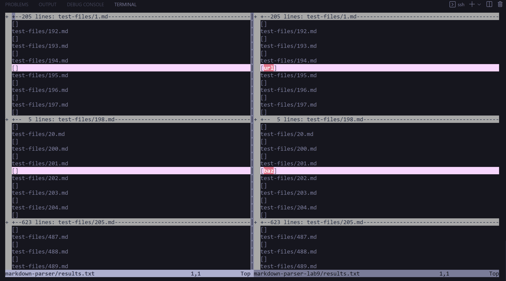

# Comparing Two Implementations of MarkdownParse
## By Isabella Real

# Finding Differences
To compare the different test results, I used the vimdiff command on the results.txt files to be able to view the different outputs side by side.

I found differences in the results of test cases in these test files:
1. [194.md](194.md)
2. [201.md](201.md)
