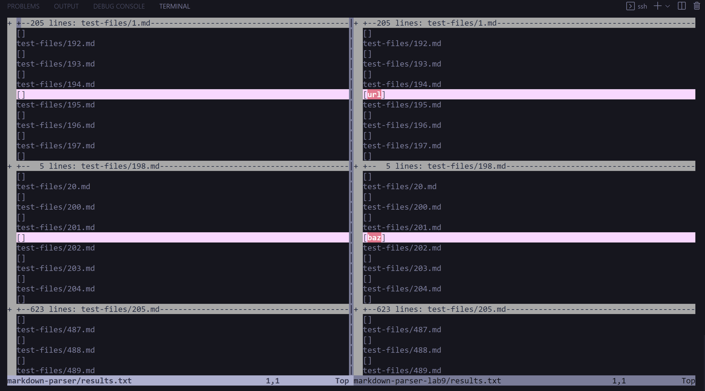
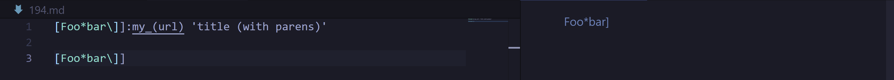
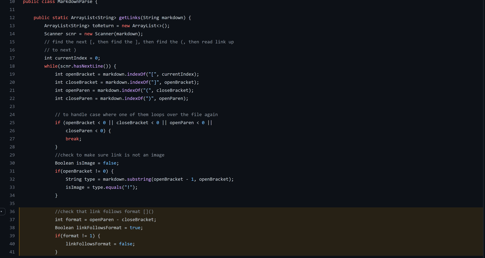
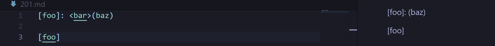
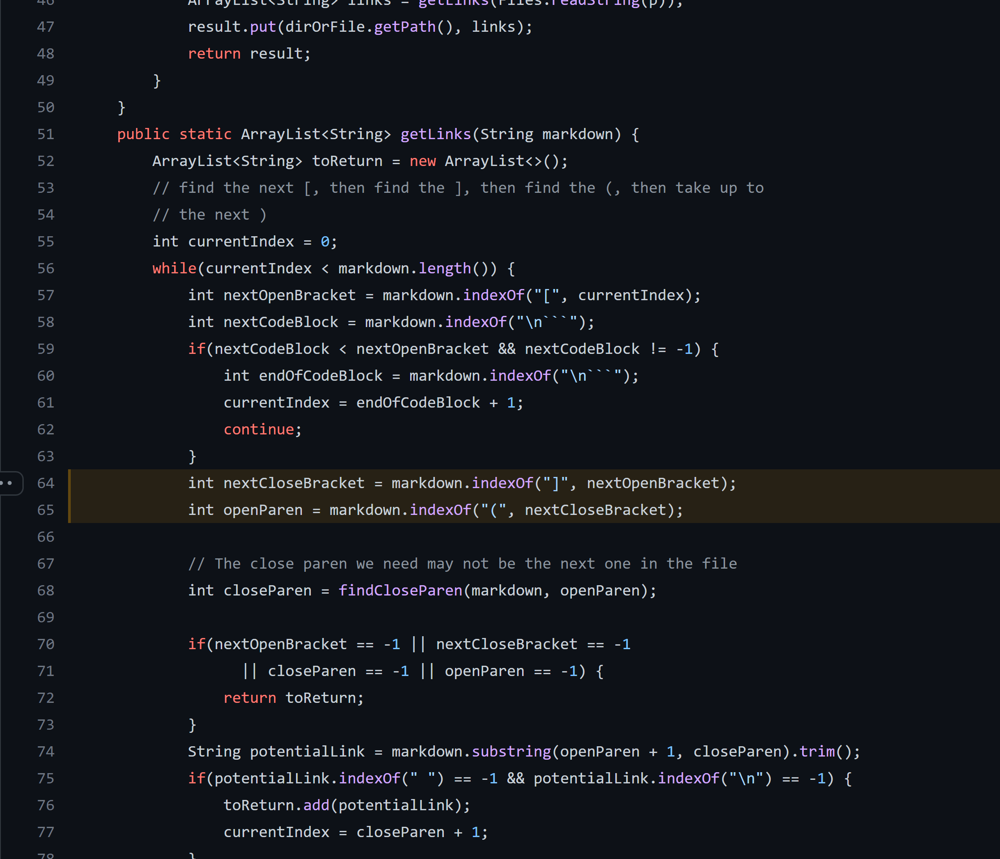

# Comparing Two Implementations of MarkdownParse
## By Isabella Real

### Finding Differences:
In order to more easily reference and view the results of the tests, I ran the 
command `bash script.sh > results.txt` which saved the output of running 
script.sh into a new file called results.txt.  I did this in both my repository
as well as the provided repository in order to compare the output of the 
different implementations. To compare the different test results, I used the 
`vimdiff` command on the results.txt files in different repositories to be able
to view the files side by side.

### Two differences in the results of test cases are when these files are tested:
1. [194.md](https://github.com/nidhidhamnani/markdown-parser/blob/main/test-files/194.md)
2. [201.md](https://github.com/nidhidhamnani/markdown-parser/blob/main/test-files/201.md)

### Test 194: 

- The correct implementation for this particular test case was the provided 
version of MarkdownParse.java, not my own. Can be found here: 
[provided repo](https://github.com/nidhidhamnani/markdown-parser/blob/main/MarkdownParse.java)
- The links expected in the output are just [url] and the actual outputs for 
both can be seen in the image above.
- The problem with my code for this test is that it checks the format in a very
strict way, it only allows for the format to have the parenthesis directly next 
to the brackets.  But the CommonMark rules don't seem to enfore this in this 
case so the area in my code that would need to be adjusted would be the section 
where I determine if the link follows proper formatting (shown in the image 
below).

### Test 201:

- The correct implementation for this particular test case was my own implementation
of MarkdownParse.java, not the provided one. Can be found here:
[my own repo](https://github.com/BellaReal/markdown-parser/blob/main/MarkdownParse.java)
- There are no links that should be part of the results for this test, and the 
actual results for both tests can be seen in the image above.
- The issue with this implementation is that according to commonmark, some 
things are allowed between the brackets and parenthesis, and others aren't.
This implementation allows for any text to occur between the closing bracket 
and the opening parenthesis. Below is an image of the lack of the area where a 
condition could be added (including the highlighted variables) to only accept 
certain characters/text between the closing bracket and opening parenthesis.
